# Smart Restaurant - System Architecture

## High-Level Architecture Diagram

```mermaid
flowchart TB
    subgraph Client["Client Layer"]
        Customer["👤 Customer<br/>(React + Vite)"]
        Waiter["👔 Waiter<br/>(React Dashboard)"]
        Kitchen["👨‍🍳 Kitchen<br/>(KDS Display)"]
        Admin["⚙️ Admin<br/>(Dashboard)"]
    end

    subgraph Server["Server Layer (Node.js + Express)"]
        API["RESTful API<br/>(Express Router)"]
        Auth["Authentication<br/>(JWT)"]
        Socket["Real-time Engine<br/>(Socket.IO)"]
        
        subgraph Controllers
            AuthCtrl["Auth Controller"]
            MenuCtrl["Menu Controller"]
            OrderCtrl["Order Controller"]
            PaymentCtrl["Payment Controller"]
            TableCtrl["Table Controller"]
        end
        
        subgraph Services
            EmailSvc["Email Service<br/>(Nodemailer)"]
            PaymentSvc["Payment Service"]
            SocketSvc["Socket Service"]
        end
    end

    subgraph Database["Data Layer"]
        MongoDB[(MongoDB<br/>NoSQL Database)]
        
        subgraph Collections
            Users[("Users")]
            MenuItems[("Menu Items")]
            Orders[("Orders")]
            Tables[("Tables")]
            Categories[("Categories")]
        end
    end

    subgraph External["External Services"]
        Stripe["💳 Stripe<br/>(Payment Gateway)"]
        Email["📧 Email Server<br/>(SMTP)"]
        QRGen["📱 QR Code<br/>(qrcode lib)"]
    end

    %% Client to Server connections
    Customer -->|HTTP/REST| API
    Customer -->|WebSocket| Socket
    Waiter -->|HTTP/REST| API
    Waiter -->|WebSocket| Socket
    Kitchen -->|WebSocket| Socket
    Admin -->|HTTP/REST| API

    %% Server internal connections
    API --> Auth
    API --> Controllers
    Controllers --> Services
    Socket --> SocketSvc
    
    %% Services to External
    PaymentCtrl --> Stripe
    EmailSvc --> Email
    TableCtrl --> QRGen
    
    %% Database connections
    Controllers --> MongoDB
    MongoDB --> Collections

    style Customer fill:#E3F2FD
    style Waiter fill:#FFF3E0
    style Kitchen fill:#F3E5F5
    style Admin fill:#E8F5E9
    style MongoDB fill:#C8E6C9
    style Socket fill:#FFE082
    style Stripe fill:#B39DDB
```

## Component Architecture

## Data Flow Diagram - Order Process

## Technology Stack Details

### Frontend
- **Framework:** React 18.3+ with TypeScript
- **Build Tool:** Vite 6.0
- **Styling:** TailwindCSS 3.4
- **Routing:** React Router DOM 7.11
- **HTTP Client:** Axios 1.13
- **Real-time:** Socket.IO Client 4.8
- **State Management:** React Context API
- **Notifications:** React Toastify

### Backend
- **Runtime:** Node.js (ES Modules)
- **Framework:** Express.js 4.18
- **Database:** MongoDB 8.0 with Mongoose ODM
- **Authentication:** JWT (jsonwebtoken 9.0)
- **Real-time:** Socket.IO 4.6
- **Payment:** Stripe SDK 14.9
- **Email:** Nodemailer 6.10
- **Security:** Helmet, CORS, Rate Limiting
- **File Upload:** Multer + Cloudinary
- **API Docs:** Swagger UI

### Database Schema Highlights

**Users Collection:**
- Roles: super_admin, admin, waiter, kitchen, customer, guest
- Authentication: Email/Password + Google OAuth support
- Email verification & password reset

**Menu Items Collection:**
- Embedded modifiers (sizes, toppings)
- Multiple images with primary image
- Category references
- Popularity tracking (totalOrders)

**Orders Collection:**
- Table binding for dine-in
- Item-level status tracking
- Payment integration (Stripe)
- Real-time status updates

**Tables Collection:**
- QR code generation
- Unique tokens for security
- Location/area grouping

## Deployment Architecture

## Security Features

1. **Authentication & Authorization**
   - JWT-based authentication
   - Role-based access control (RBAC)
   - Token expiration & refresh mechanism

2. **Input Validation**
   - Express-validator for API inputs
   - Client-side validation
   - XSS protection

3. **Rate Limiting**
   - API rate limiting (100 req/15min in production)
   - Flexible limits for development

4. **Security Headers**
   - Helmet.js for HTTP headers
   - CORS configuration
   - CSRF protection for payments

5. **Payment Security**
   - Stripe webhook signature verification
   - PCI-compliant payment processing
   - No credit card storage

## Real-time Features via Socket.IO

**Rooms/Namespaces:**
- `{restaurantId}:waiter` - Waiter notifications
- `{restaurantId}:kitchen` - Kitchen display updates
- `table:{tableId}` - Customer order updates
- `order:{orderId}` - Order-specific events

**Events:**
- `order:new` - New order notification
- `order:accepted` - Order accepted by waiter
- `order:preparing` - Kitchen started cooking
- `order:ready` - Order ready to serve
- `order:statusUpdate` - General status updates

---

**Generated:** January 2026  
**Project:** Smart Restaurant QR Ordering System
